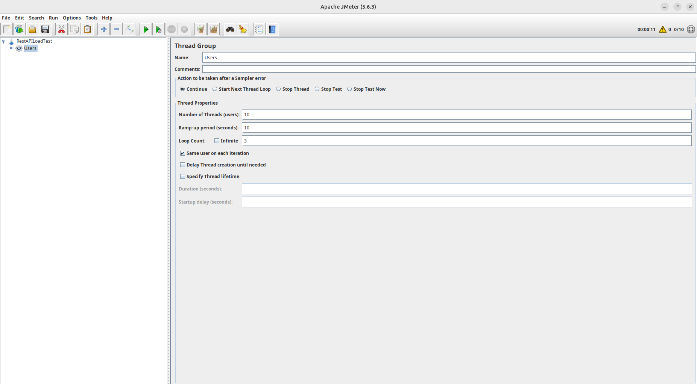
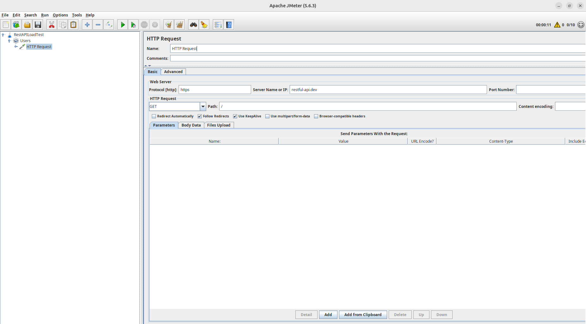
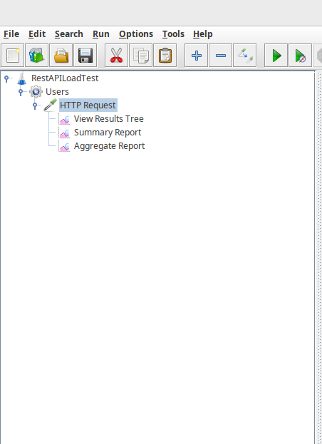
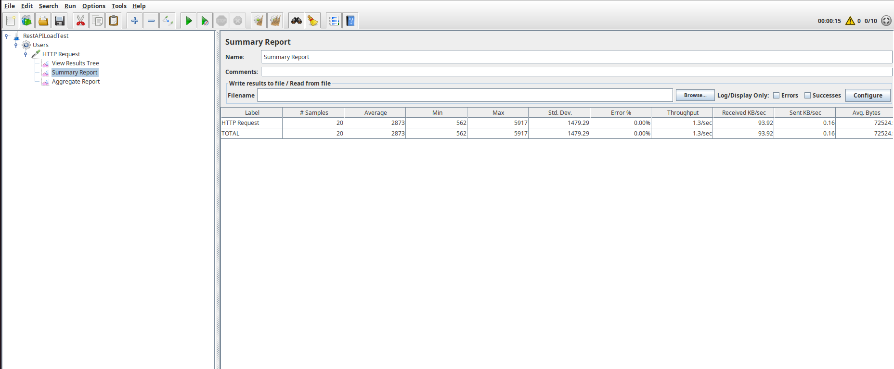
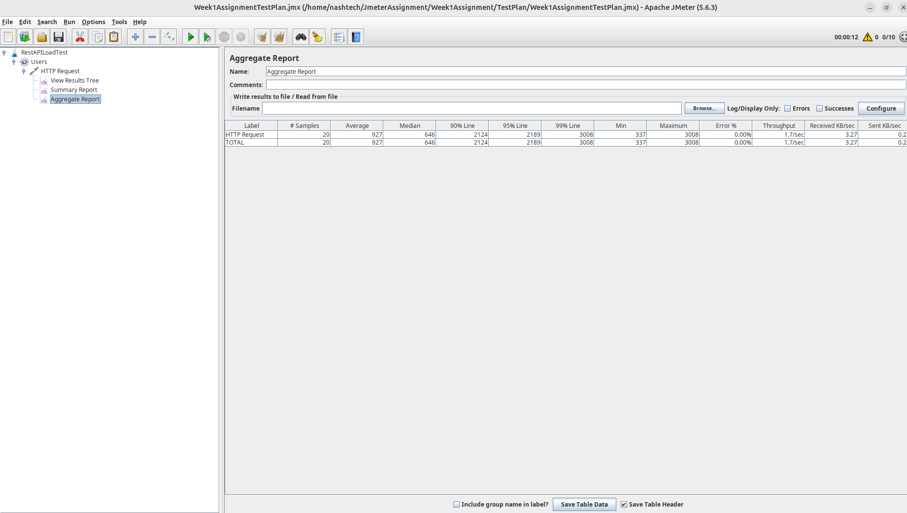
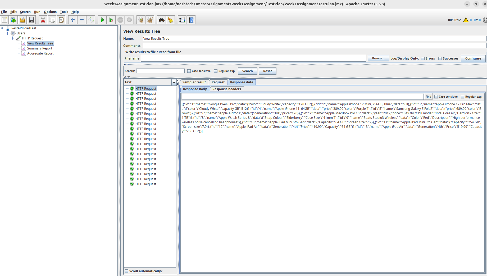
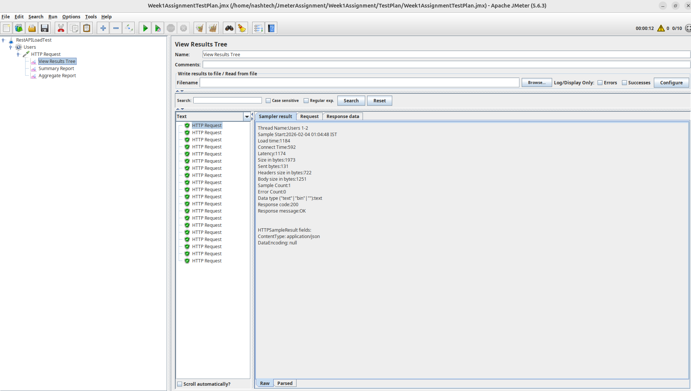

# JMeter Load Testing Assignment - Week 1

## Objective
To perform load testing on a public REST API using Apache JMeter.

## Test Plan Configuration
- Users: 10
- Ramp-up Period: 10 seconds
- Loop Count: 2
- Total Requests: 20

## API Tested
GET https://api.restful-api.dev/objects

## Listeners Used
- View Results Tree
- Summary Report
- Aggregate Report

## Observations
- Average Response Time: The average response time observed during the test execution was 927 ms.
- P90: 90% of the requests were completed within 2124 ms.
- P95: 95% of the requests were completed within 2189 ms.
- Throughput: The achieved throughput was approximately 1.7 requests per second.
- Error %: No errors were observed during the test execution, and the error rate remained 0%.

## Screenshots

### Created Test Plan

### Thread Group

### HTTP Request

### Listeners

### Summary Report

### Aggregate Report

### View Results Tree

### Execute the test in GUI Mode

